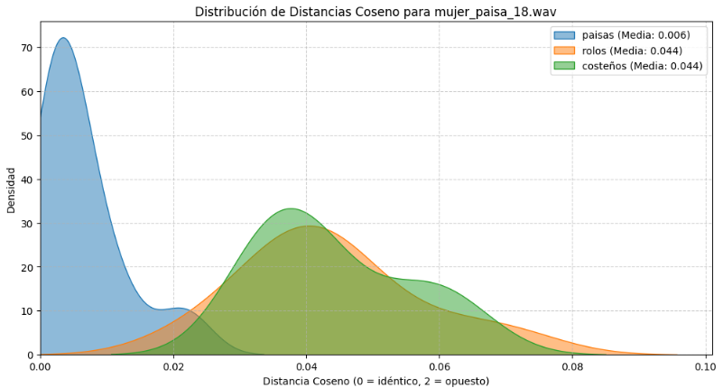

# 🇨🇴 Clasificación de Acentos Colombianos mediante DSP Artesanal


Este proyecto implementa un sistema completo de reconocimiento de patrones de voz para distinguir entre tres acentos colombianos (**Paisas, Rolos y Costeños**).

A diferencia de las soluciones modernas basadas en librerías de "caja negra" (como `librosa` o `torchaudio`), este proyecto se destaca por la **implementación matemática manual** de cada etapa del procesamiento digital de señales (DSP), desde el filtrado FIR hasta el cálculo matricial de la DCT, demostrando un dominio profundo de los fundamentos teóricos del tratamiento de voz.

---

## 🧠 Fundamento Teórico y Metodología

El núcleo del proyecto se basa en la teoría **Fuente-Filtro** de la producción de voz y en la extracción de coeficientes **MFCC (Mel Frequency Cepstral Coefficients)**. A continuación se detalla la justificación de ingeniería para cada etapa:

### 1. Preprocesamiento Riguroso
Para garantizar que el modelo clasifique acentos y no calidades de grabación, se estandarizó la señal siguiendo estrictos criterios de DSP:

* **Normalización de Amplitud:** Se escala la señal al rango `[-1, 1]`. Esto elimina el sesgo del volumen (ganancia del micrófono) en el cálculo de distancias vectoriales.
* **Filtro Anti-Aliasing (Pre-Remuestreo):** Se diseñó e implementó un filtro pasa-bajas FIR con ventana Hamming y frecuencia de corte en **7 kHz**.
    * *Justificación:* Al reducir la tasa de muestreo a 16 kHz (Nyquist = 8 kHz), cualquier frecuencia superior a este límite sufriría **Aliasing** (solapamiento), "disfrazándose" de frecuencia baja y corrompiendo los formantes vocales. El filtrado previo es obligatorio para preservar la integridad espectral.
* **Remuestreo (Resampling):** Implementado mediante **Interpolación Lineal Manual**. Se reduce la señal a 16 kHz para disminuir la carga computacional, manteniendo la información relevante de la voz humana (que reside mayoritariamente bajo los 8 kHz).

### 2. Validación Estadística de la Base de Datos
Se verificó mediante pruebas estadísticas que los sujetos de prueba estuvieran pareados por edad entre los diferentes acentos.
* *Importancia:* La voz sufre cambios fisiológicos con la edad (presbifonia). Asegurar la paridad de edad garantiza que el clasificador aprenda a distinguir **regiones geográficas** y no grupos etarios (evitando sesgos como "Joven vs Viejo").

### 3. Extracción de Características (Pipeline MFCC)

El proceso de convertir audio en vectores matemáticos sigue estos pasos críticos:

* **Enventanado (50 ms con solape del 50%):**
    * *Por qué 50ms:* Aunque la voz no es estacionaria, el tracto vocal tiene inercia física. En intervalos de 50ms, la señal se considera **cuasi-estacionaria**, permitiendo un análisis espectral válido.
    * *Por qué Hamming:* Multiplicar por una ventana de Hamming suaviza los bordes de la trama a cero, eliminando las discontinuidades temporales que causarían **Fuga Espectral (Spectral Leakage)** en la FFT.
* **Banco de Filtros Mel (26 Filtros):**
    * Se utiliza una escala no lineal que imita la percepción auditiva humana (mayor resolución en bajas frecuencias). Esto permite capturar con precisión los **Formantes ($F_1, F_2$)**, resonancias que definen las vocales y el timbre del acento.
* **Transformada Discreta del Coseno (DCT):**
    * *Selección de 13 Coeficientes:* Al aplicar la DCT y conservar solo los primeros 13 coeficientes ("baja quefrencia"), aislamos la **Envolvente Espectral** (forma del tracto vocal/acento) y descartamos la información de la excitación (pitch del individuo).

### 4. Modelado Estadístico (El Vector de Acento)
Cada audio se reduce a un vector único de 26 dimensiones mediante **Pooling Estadístico**:

| Característica | Representación Física |
| :--- | :--- |
| **Media ($\mu$)** | Representa el **Timbre Estático**. Indica la configuración promedio de la boca y la resonancia base del hablante. |
| **Desviación Estándar ($\sigma$)** | Representa la **Prosodia y Dinámica**. Captura el "cantadito" o ritmo del acento (ej. la alta variabilidad tonal del acento paisa vs. la planitud del rolo). |

---

## 📂 Estructura del Proyecto

```text
├── data/                   # Base de datos de audios (Paisas, Rolos, Costeños)
├── src/                    # Código fuente
│   ├── main.py             # Script maestro de ejecución y clasificación
│   └── dsp_utils.py        # Funciones matemáticas manuales (FFT, DCT, Filtros)
├── images/                 # Gráficas de resultados y diagramas de bloques
├── README.md               # Documentación del proyecto
└── requirements.txt        # Dependencias necesarias
```
---

### 📊 Resultados y Eficiencia
El modelo demuestra que no son necesarios algoritmos complejos de Deep Learning para tareas con datasets pequeños si la Ingeniería de Características es robusta.

* **Eficiencia:** El entrenamiento con 30 audios toma menos de 10 segundos en CPU.

* **Interpretabilidad:** El modelo es totalmente explicable ("White Box").

## Desempeño:

* **Paisas:** Alta precisión debido a la detección de sibilancia y alta desviación estándar (prosodia dinámica).

* **Rolos vs Costeños:** Discriminación basada en la aspiración de consonantes y la estabilidad vocálica.

## 📈 Visualización de Distancias
El sistema utiliza la Distancia Coseno para comparar el vector de entrada con los centroides de cada acento.



### 🔮 Trabajo Futuro
Para escalar este proyecto a un entorno de producción:

* **Ampliación del Dataset:** Recolección de muestras en ambientes ruidosos para probar la robustez del filtrado.

* **Clasificadores No Lineales:** Implementación de SVM (Support Vector Machines) para encontrar fronteras de decisión más complejas.

* **Deep Learning:** Uso de CNNs sobre espectrogramas para detectar patrones visuales sutiles si se contara con miles de horas de datos.

## 🛠️ Instalación y Uso
1. Clonar el repositorio:
```bash
git clone https://github.com/cdanielrua/colombian-accent-classifier.git
```

2. Instalar dependencias:
```bash
pip install -r requirements.txt
```

3. Configurar rutas y ejecutar: 
Abre `src/main.py`, ajusta la variable `base_path` a tu carpeta de datos y ejecuta:
```bash
python src/main.py
```
👨‍💻 Desarrollado por Daniel Rúa
Desarrollado como proyecto final para la asignatura de Tratamiento de Señales. Ingeniería Electrónica / Telecomunicaciones